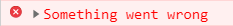
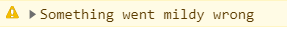
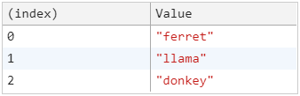
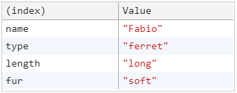
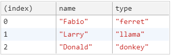
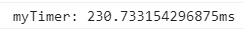
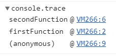
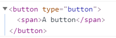
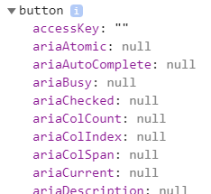

There are dozens of console methods. In this article I'll go through some I've found the most useful in my work.

- [console.error()](#consoleerror)
- [console.warn()](#consolewarn)
- [console.table()](#consoletable)
- [console.time()](#consoletime)
- [console.trace()](#consoletrace)
- [console.dir()](#consoledir)

##console.error()##
Prints an error message to the console. Note that this does not actually throw an error, it is purely visual.

```js
console.error("Something went wrong");
```



##console.warn()##
Prints a warning message to the console. Much like `console.error()` this is only visual.

```js
console.error("Something went mildly wrong");
```



##console.table()##
The `console.table()` method takes an array or an object as argument and displays the data in a table.

####Array####

```js
const animals = ["ferret", "llama", "donkey"];
console.table(animals);
```



####Object####

```js
const animal = {
  name: "Fabio",
  type: "ferret",
  length: "long",
  fur: "soft",
};

console.table(animal);
```



####Array of objects####
Perhaps the most useful for logging an array of objects:

```js
const animals = [
  {
    name: "Fabio",
    type: "ferret",
  },
  {
    name: "Larry",
    type: "llama",
  },
  {
    name: "Donald",
    type: "donkey",
  },
];

console.table(animals);
```



##console.time()##
`console.time()` starts a timer to track how long an operation takes. `console.timeEnd()` ends the timer and logs the elapsed time.
Takes a name as an argument.

```js
console.time("myTimer");

let counter = 0;
while (counter < 99999999) {
  counter++;
}

console.timeEnd("myTimer");
```



##console.trace()##
console.trace logs the call stack that exists up until console.trace() was called. Useful in large code bases for debugging purposes.

```js
function firstFunction() {
  secondFunction();
}

function secondFunction() {
  console.trace();
}

firstFunction();
```



##console.dir()##
`console.dir()` is very useful for logging DOM elements. Of course you could do this using `console.log()`, but this would
give you a DOM representation of the element, whereas `console.dir()` gives you the object and its properties.

####With console.log()####

```js
const buttonElement = document.querySelector("button"); // selects an element
console.log(buttonElement);
```



####With console.dir()####

```js
const buttonElement = document.querySelector("button"); // selects an element
console.dir(buttonElement);
```


