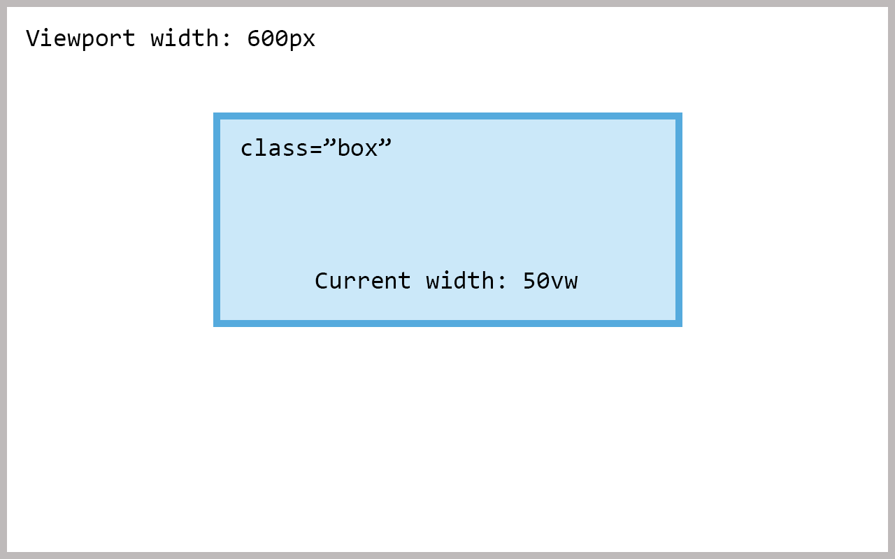
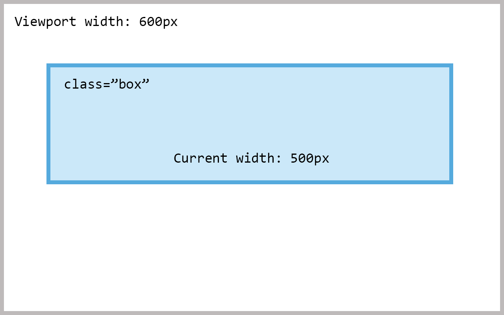

##min()##
The `min()` lets you set the smallest value from a list of values.
For example:

```css
.box {
  width: min(50vw, 500px);
}
```

With this our box will have a width of `50vw` or `500px`. Whichever is the smallest.

If `50vw` (50% of the viewport width) computes to a lower value than `500px` the element will be `50vw` wide.



In the example above the viewport is 600 pixels wide. `min(50vw, 500px)` will therefore return `50vw` because 50% of 600 pixels is 300 pixels. And 300 is less than 500.

##max()##
Works much the same as its brother `min()` but it picks the largest value from a list of values.

```css
.box {
  width: max(50vw, 500px);
}
```



In this example our box gets a width of 500 pixels. Because 500 is greater than 300 (50% of the viewport).

##clamp()##
Clamp is effectively a combination of the `min()` and `max()` functions. It accepts three parameters:

1. minimum value
2. preferred value
3. maximum value

Consider this:

```css
.box {
  width: clamp(400px, 50vw, 1200px);
}
```

This will ensure three things:

- The width will never go below `400px`.
- The width will be `50vw` as long as it's not smaller than `400px` or larger than `1200px`.
- The width will never go above `1200px`.

In other words, this makes it so that the box's width is `50vw` but never smaller than `400px` or larger than `1200px`.
