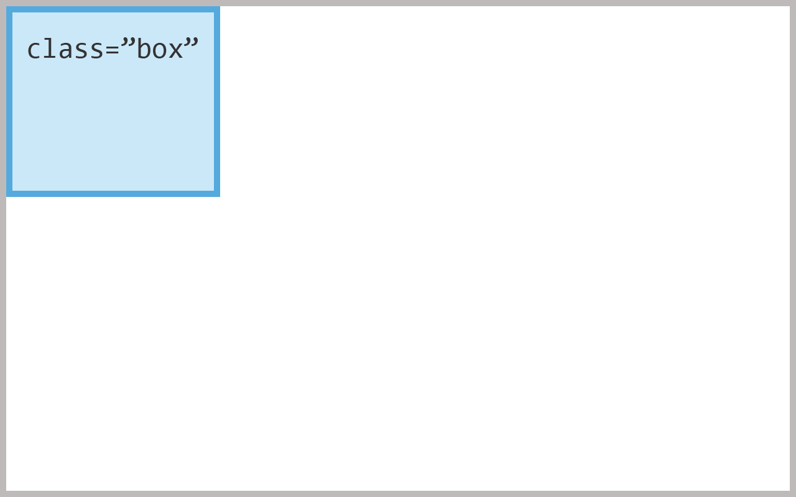
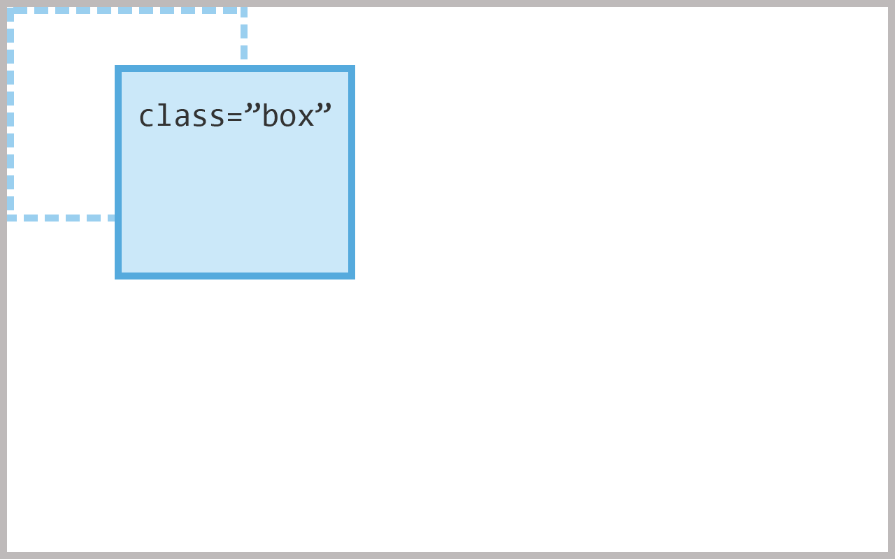
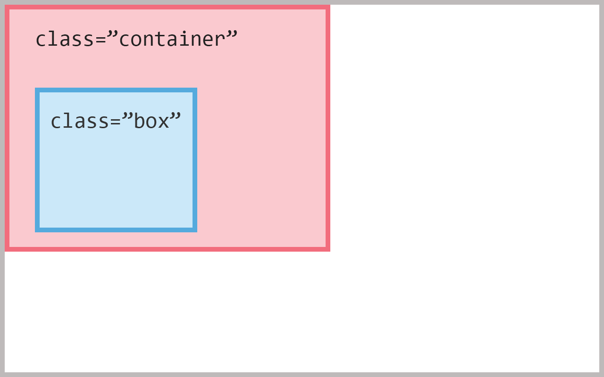
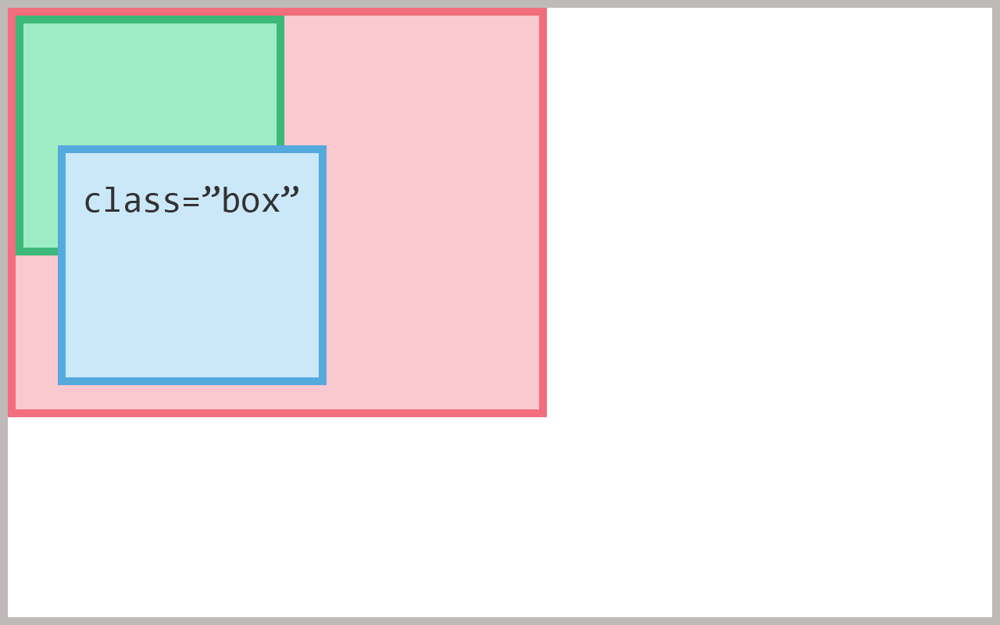
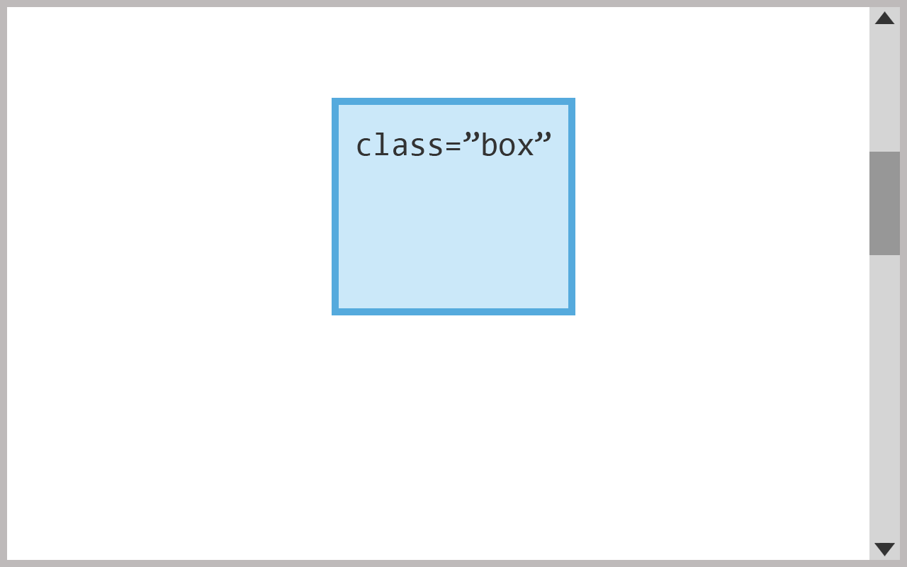

The CSS position property is one of the fundamental properties you need to know in order to feel
truly comfortable in your CSS knowledge. So before you start digging deep into CSS do yourself a favor
and learn it. Don't worry though, it's really rather simple.

##Values##
There are 5 possible values of the position property:

- [static](#static)
- [relative](#relative)
- [absolute](#absolute)
- [fixed](#fixed)
- [sticky](#sticky)

These five position values change how the **top**, **bottom**, **left** and **right** properties affect the element.
(With the exception of static which is not affected.)

##static##
This is the default position value, all elements have a position of static unless you have specified otherwise.

Elements with `position: static;` are not positioned in any special way and simply follows the normal flow of the webpage. Top, bottom, left and right will not affect elements with a position value of static.

```css
.box {
  position: static;
}
```



##relative##
Elements with relative positioning are positioned relative to their normal(static) position.
Top, bottom, left and right moves the element away from this position.

```css
.box {
  position: relative;
  top: 20px;
  left: 50px;
}
```

This will adds 20 pixels to the top of the elements original position and
50 pixels to left.

This positions the element 20 pixels from the top and 50 pixels to the left of the elements original position.



##absolute##
The position of an element with `position: absolute;` is based on its nearest **positioned** parent i.e. the nearest
wrapping element with a position other than static.

```css
.container {
  position: relative;
}

.box {
  position: absolute;
  bottom: 10px;
  left: 15px;
}
```

This will position our element 10 pixels from the bottom and 15 pixels from the left of our **positioned parent**.



**Do note** that absolute(and fixed) elements are removed from the normal document flow. Meaning it wont affect any other
elements, they will behave as if there is no other element there. Our element may therefore end up on top of another.



This unsuspecting element has been partially covered by our box.

##fixed##
Fixed elements are always positioned relative to the document i.e. the browser window. Which means they are are
also not affected by scrolling.

```css
.box {
  position: fixed;
  top: 30px;
  left: 100px;
}
```

This positions the element 100 pixels from the left and 30 pixels from the top of the window, no matter how far down the page you scroll.



Like with `position: absolute;` fixed elements are removed from the document flow. See [absolute](#absolute).
This makes fixed elements useful for popups and modals.

##sticky##
`position: sticky;` is a bit of a bonus and has limited albeit powerful use cases.
A sticky element behaves as if it is relative-positioned until it reaches a specified point, where it starts
behaving as if it's fixed-positioned.

Lets showcase this with an **example:**

```css
.box {
  position: sticky;
  top: 10px;
}
```

Try scrolling the window below and notice how the `.box` element behaves.

[hello world example](embedded-codesandbox://css-position/examples/position-sticky)

The moment the box hits our set threshold of 10px from the top, it **sticks** to that point as we keep scrolling.
It has gone from a `position: relative;` behavior to `position: fixed;`.
